# Flight Surety project
This repository contains an Ethereum Flight Insurance DApp which includes the use of an Oracle Server which simulates the update of the status of the flights. This project is part of Udacity's Blockchain Developer Nanodegree.

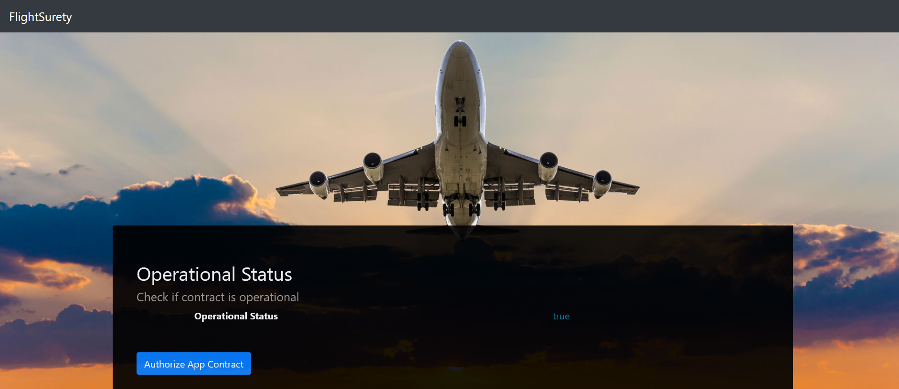

## Dapp Overview

The Dapp has been developed with the goal in mind of simplifiying the testing of all the functions of the Smart Contracts. Therefore one single page allows the different actors to interact with the contracts:
- Authorization of the App Contract by the Dapp managers
- Registration and activation of airlines
- Registration of new flights by airlines
- Fetching the status of flights by the Dapp managers
- Purchasing and claimin insurance by passengers

### Initial deployment
When migrating the Smart Contracts for the first time, the Dapp shows on the top of the page an active button which allows to authorize the App Contract to call the functions of the Data Contract.

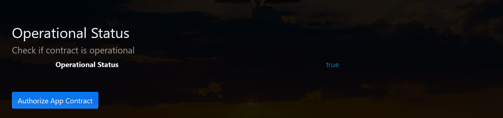

Once the App Contract is authorized, the button is disabled

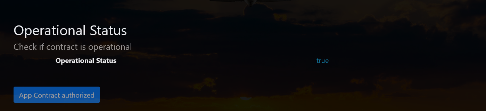

### Registration of airlines

A list is shown with the 5 accounts which are retrieved from Ganache and will be used as airline accounts. On initial deployment only the first account is registered. 

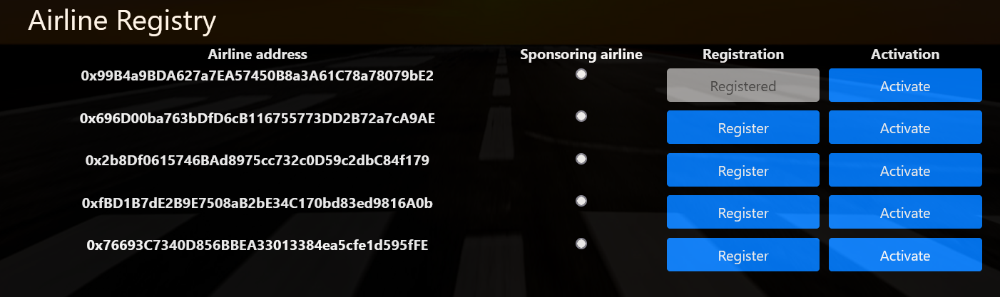

The list contains two buttons, 'register' and 'activate'.

The 'register' button allows an airline which has already funded the Data Contract (is activated) to register another airline. 
In order to do this in the Dapp, we select the sponsoring airline in the corresponding column and then click on 'register' on the airline which we want to register

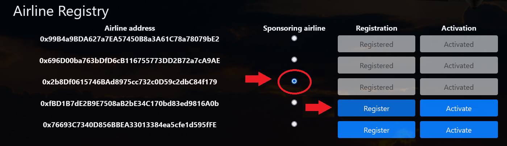

In order to fund, or activate and airline, we click on the corresponding 'Activate' button once it is registered. A new form appears under the airline which allows to specify the amount to funding that we want to send. We click on 'Fund' and the airline is activated.

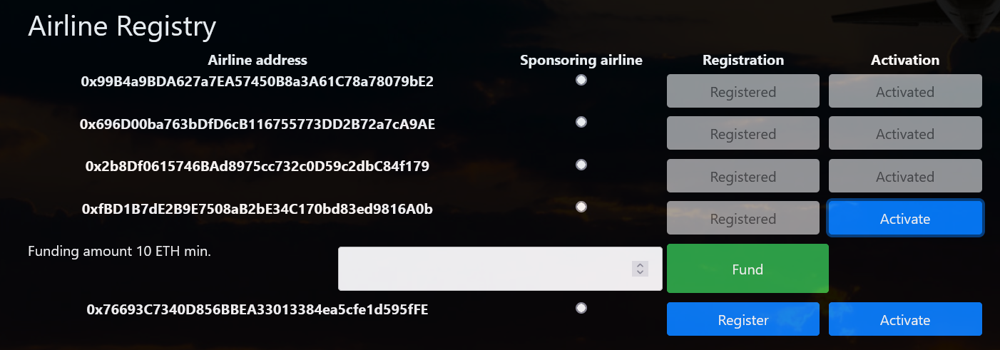

### Registration of flights

Flights need to be registered in the Data Contract. In order to do this, we enter the flight number, select the airline which operates the flight and then click on 'Register flight'

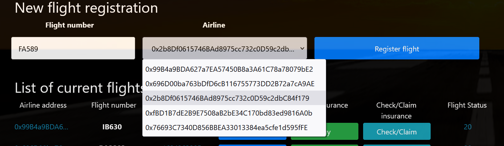

The flight will appear on the 'List of current flights'.

### List of current flights

The list of current flights shows the main flight information (flight number, airline address, timestamp), as well as the status of the flight. Three buttons are included in order to manage the different functions dealing with a flight.

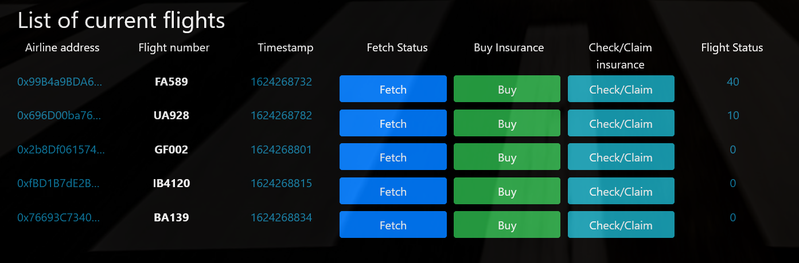

The list shows the flights that have been registered during the current browser session, it doesn't show the all the flights which are active on the Data Smart Contract.

### Fetching flight status

In order to fetch the status of a flight we simply click on the 'Fetch' button and the 'fetchFlightStatus' funtion in the App Contract is triggered. This function emits the 'oracleRequest' event.

### Buying insurance

By clicking on the 'Buy' button of a flight, a dialog pops up allowing the user to specify the passenger's address and the amount of premium to be paid for the insurance.

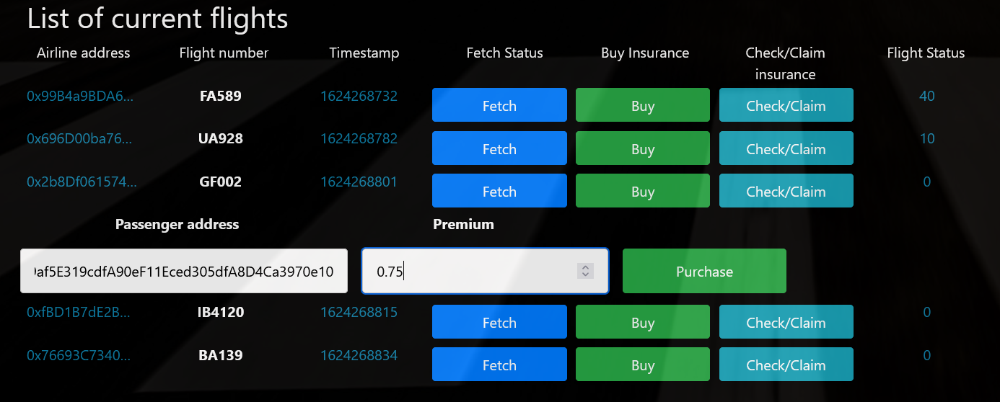

### Checking/claiming insurance

Clicking on the 'Check/Claim' button of a flight brings a dialog which allows the passenger to know the status of their insurance and claim the 1.5x refund if the flight was late.

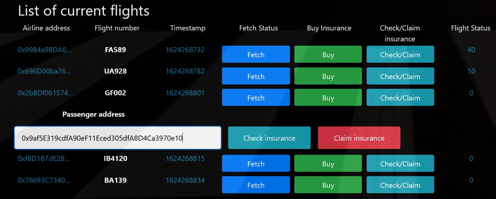

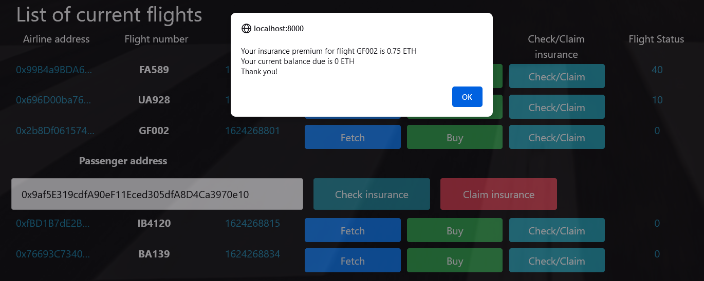

## Tests

All tests in both the flightSurety.js and the oracles.js file are passed correctly

### flightSurety.js

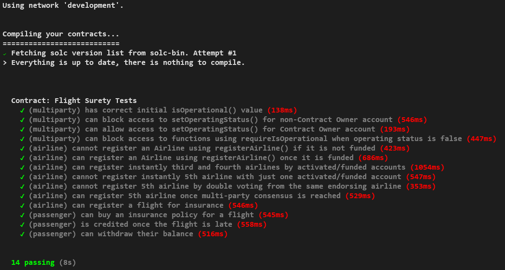

### oracles.js

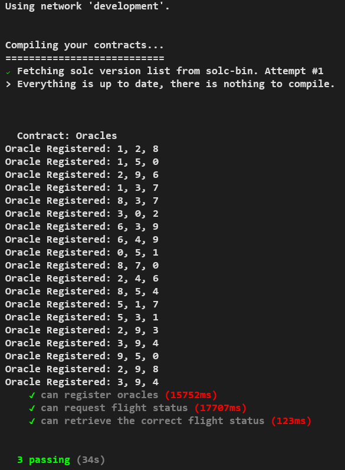

## Issues
There is a few items of data which seemed necessary to be shared by both contracts. For instance, there is flight information data which is shared on both the App and Data Contract. Airlines are created from the App contract, but the data is stored on the Data Contract. This somehow duplicates data and results in a few calls being made between the contracts. If a function (i.e registerAirline) is called on the App Contract, it is not simple to make it 'fail fast', since it has to rely on the Data Contract for this. This could be an issue in terms of gas efficiency and data coherence and could be looked into in further developments

It wasn't clear for me what happens after the status of a flight changes from the initial 0 to another status. I have decided that once the status is different from 0, this status can no longer be changed and therefore no new oracle responses are allowed. In order to achieve this I have introduced the bool variable `landed` which is set from _false_ to _true_ once the status is different from 0. This variable is required to be _false_ in order to trigger any `OracleRequest` events or process flight status.

At this moment, the Dapp only shows the list of flights which have been registered on the same browser session. It doesn't show all the flights which are active on the Smart Contract. A specific function and mapping variable could be created on the Data Contract which would allow to retrieve all the flights which are active.

## Software versions
Truffle v5.2.3 (core: 5.2.3)
Solidity - ^0.4.24 (solc-js)
Node v10.19.0
Web3.js v1.2.9

## Built With

* [Ethereum](https://www.ethereum.org/) - Ethereum is a decentralized platform that runs smart contracts
* [Truffle Framework](http://truffleframework.com/) - Truffle is the most popular development framework for Ethereum with a mission to make your life a whole lot easier.

## Acknowledgments

* Solidity
* Ganache-cli
* Truffle
* Udacity
